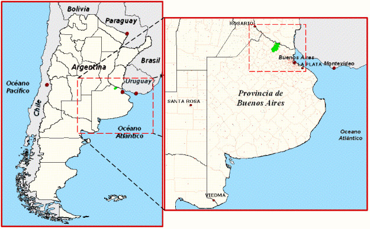
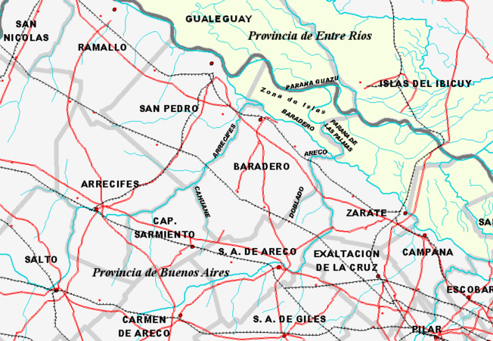

Desarrollo
==========

Para el desarrollo del trabajo se han tomado como referencia las siguientes fases metodológicas:

* Caracterización_: en esta fase se caracteriza la situación y el contexto geográfico, se realiza una revisión histórica, un análisis socio-económico, y se detalla el estado actual de la división y el uso del suelo.

* Diagnóstico_: comprende un análisis de los datos e información obtenidos en la fase anterior, tendiente a comprender los procesos de desarrollo y transformación, y las interrelaciones que actúan en el territorio de la ciudad y su entorno, y las fuerzas que operan los mismos.

* `Propuesta de solución`_: aborda el problema de elaboración de la propuesta de ordenanza para *Designación de Reservas de Expansión Urbana* y la documentación respaldatoria.

* Anexos_: incluye información detallada del marco cartográfico utilizado y los prácticos *"Territorio y Ambiente"* y *"Zonificación tipo para una manzana urbana"*.

Caracterización
---------------

Información general
^^^^^^^^^^^^^^^^^^^

La Ciudad de Baradero es la cabecera del Partido que lleva el mismo nombre y que se encuentra ubicado al noreste de la Provincia de Buenos Aires. Además es el centro económico y demográfico del mismo (ilustraciones `1 <#baradero-ubic>`_ y `2 <#baradero-limit>`_).

Según la Constitución de la Provincia de Buenos Aires, la administración de los intereses y servicios locales en cada uno de los partidos que forman la provincia, están a cargo de una municipalidad.

A continuación se muestra una síntesis de las características del Partido de Baradero:

* Superficie: 1533 km²

* Perímetro: 220 km

* Extensión:

  * 59º 46' - 59º 10' Oeste

  * 34º 10' - 33º 39' Sur

* Población del partido: 29.562 habitantes

* Distribución demográfica:

  * Población rural: 2.859 hab.

  * Población urbana: 26.703 hab.

    * Baradero: 24.901 hab.

    * Villas Alsina: 1.184 hab.

    * Portela: 449 hab.

    * Santa Coloma: 169 hab.

.. _baradero-ubic:

   Ilustración 1: ubicación a nivel nacional y provincial.

.. _baradero-limit:

   Ilustración 2: límites y entorno del Partido de Baradero.

Límites
"""""""

Los límites del Partido de Baradero son (ilustración `2 <#baradero-limit>`_):

* Al **Oeste** con el Partido de San Pedro, río Arrecifes mediante, y con el Partido de Capitán Sarmiento, en parte con el arroyo Cahuané mediante.

* Al **Sur** con el Partido de San Antonio de Areco, en parte con el arroyo Doblado mediante.

* Al **Este** con el Partido de Zárate, en parte con el río Areco mediante, y en parte con el río Paraná de las Palmas.

* Al **Norte** limita con los departamentos Gualeguay e Islas del Ibicuy, pertenecientes a la Provincia de Entre Ríos, río Paraná Guazú mediante.

Características geográficas
"""""""""""""""""""""""""""

El Partido de Baradero se encuentra dentro de la región ecológica denominada pampa húmeda, subregión pampa ondulada, llamada así debido a las ondulaciones que presenta. Estas ondulaciones se formaron debido a movimientos ascendentes y descendentes que se produjeron hace miles de años y que dieron origen a las barrancas en esta zona. Todos los partidos de la zona que están en contacto con el Paraná terminan en barranca. La de Baradero se llama barranca muerta, porque esta separada del río por un bajo o faja ribereña. Sobre este fajo ribereño corre el río Baradero, brazo del Paraná, y entre este río y el Paraná, se se encuentra la Isla de las Lechiguanas. Una parte de esta isla pertenece al Partido de Baradero. La Ciudad de Baradero se encuentra sobre la margen sur del río Baradero.

Origen de la población
^^^^^^^^^^^^^^^^^^^^^^

Pueblos originarios
"""""""""""""""""""

El territorio de Baradero originalmente se caracterizaba por la presencia de *"campos de espinillos, talas, y sarandíes, sobre agrestes y abruptas barrancas, sobre sinuosas líneas, y carcomidas en muchas partes por los caprichosos desagües de las lluvias"*.

La región era habitada por pueblos nómades, cazadores y recolectores. Posiblemente era la conjunción y encuentro entre los guaraníes y los pampas. Desde la desembocadura del Paraná, sus islas y afluentes, hasta unas cuarenta leguas hacia el noroeste y sobre la margen izquierda, habitaban los indios Querandíes; en tanto los que habitaban la costa austral del Río de La Plata se los denominaba Querandos. Sobre la margen derecha siempre yendo de este a oeste, tenían sus asentamientos los indios Guaraníes. Las islas estaban habitadas por los indios Chanás y desde la desembocadura del Paraná hasta cuarenta leguas teníamos los indios Guaníes, y sucesivamente los indios Albeguay, Baguales y Cayguanés. Desde el Río Luján hasta el Río de Areco, estaban los indios Baguales, y desde el Río de Areco al Río de los Querandíes habitaron los indios Cayguanés, tribu muy numerosa entre los dos ríos, y en un afluente del Río de los Querandíes, el arroyo Caguané. El Río de los Querandíes es el hoy llamado Río Arrecifes.

[MAPA]

Conquista y colonización
""""""""""""""""""""""""

Con la llegada de los conquistadores, a principios del siglo XVI, se sucedieron crueles y sangrientas batallas, en particular contra los Guaníes y Albeguay, que se resistían obstinadamente al dominio del conquistador. La tribu de los Querandíes también fueron diezmados y perseguidos sin reparo, y finalmente abandonaron sus tolderías y se fueron retirando durante 50 años rumbo al sur, hasta la Sierra de “El Volcán” (Sierras de Tandil).

Mientras se daba este éxodo aborigen, desde las riberas del Paraná los “Alarifes” de Don Juan de Garay, tiempo antes de la fundación de la ciudad de Buenos Aires en 1580, comenzaron a deslindar la margen izquierda desde la desembocadura hasta poco más del Río de los Querandíes (actualmente conocido como río Arrecifes).

En el comienzo de la actividad conquistadora y colonizadora del hombre blanco, la zona comprendida por el Partido de Baradero, era conocida como Pago de los Arrecifes, un área de límites fluidos e indefinidos. Los procesos más destacados de aquella época fueron la búsqueda de los caminos a Córdoba y a Santa Fe, la lucha contra el indio, y la codicia del hombre blanco por la tierra.

El Pago de los Arrecifes comprendía porción de los actuales partidos de San Pedro, Baradero, Salto, Carmen de Areco, San Antonio de Areco, Pergamino, y Arrecifes. Estos lugares estaban vinculados desde Buenos Aires por los caminos a Córdoba y Santa Fe, que actualmente se corresponden con las rutas N° 8 y N° 9 respectivamente.

La primera constancia que se conoce sobre el establecimiento humano en este Pago, es el título otorgado el 14 de mayo de 1594 por el gobernador Hernando de Zárate a Andrés Ximénez de Fuentes. Según la merced, quedarían comprendidos en la actualidad la mitad sur del partido de San Pedro, sector norte, centro, noroeste de Arrecifes y parte de islas pertenecientes a San Pedro y Baradero.

Fundación de Baradero (VER)
"""""""""""""""""""""""""""

El primer asentamiento humano formado donde hoy se encuentra la Ciudad de Baradero, fue fundado en el año 1615 por Hernando Arias de Saavedra, el primer gobernador criollo.
Su origen fue una reducción de indios, reunidos para establecer una encomienda real a cargo de franciscanos.

Los primeros aborígenes que habitaron la reducción eran cerca de 250, y fueron trasladados por el franciscano Francisco de Arena, desde las proximidades de Buenos Aires, a unas 7 leguas. Otras versiones indican que pertenecían a la zona de islas o del Paraná arriba, y que se trataba de los grupos guaraníticos Chanaes y Mbiguays.

Para que los indios poseyeran sus propias tierras, el gobernador Hernandarias les asignó una legua de campo con frente al río, que se podía medir desde la conjunción del río Arrecifes con el Paraná (así se le decía al río Baradero, que es en realidad un brazo del gran río) hasta contar 6000 varas sobre su costa, y al llegar al coto, medir otras leguas de fondo, pero descontando los bañados, hasta dar con las tierras que poseía el encomendero don Gaspar de Godoy [no hay ninguna referencia a la creación de esta encomienda y sus límites], que le fueron proveídas por el mismo Hernandarias, desde los primeros días de la fundación de esta encomienda Real.

La reducción fue una de las más organizadas, pero al igual que todas, no logró prosperar, principalmente, por las malas condiciones de las tierras en que fuera emplazada, que era un sitio pantanoso, con mala agua, poca leña y el pescadero muy alejado), la falta de adaptación del indio al régimen de gobierno impuesto por el hombre blanco, y a las enfermedades.

En  1828, parte del campo asignado a los naturales, fue cercenado por un avance que hicieron los vecinos del lado SE, provocando algunos pleitos: en la propiedad comunal de la reducción, a la vera del río Arrecifes, existía una balsa o rincón que venía a formar un sobrante perteneciente a los indios, y con el cual los vecinos litigantes pretendieron formar la legua asignada a la reducción, que administraba la iglesia.
La presencia de la reducción y la iglesia, permitieron que se asentaran en el lugar algunos españoles.

Para el año 1717, existían dos curatos de indios, el de Baradero y el de Santa Cruz de los Quilmes) y ninguno de españoles.

En octubre de 1730, en auto del Cabildo, se crearon las primeras parroquias de españoles, entre otras, Luján, Areco y Arrecifes. El curato de los Arrecifes pertenecía al pago del mismo nombre, y se extendía sobre las tierras en las que hoy se encuentran los partidos de Pergamino, Arrecifes, San Pedro y Baradero. Estos partidos eran por entonces vice-curatos, que se elevaron a curatos con jurisdicción propia en  1780, siendo el año en el que se nombra el primer alcalde de la Santa Hermandad, Justo Sosa.

Luego de la caída del gobierno de Rosas en 1852, cuenta la historia que con el regreso de los unitarios exiliados el pueblo recibió un nuevo impulso, con el que se buscó sacar al pueblo del “estado de villorio” en que se encontraba. Se reinstalaron las escuelas, se arboló el espacio designado para plaza principal, que había sido plaza de carretas y se construyó la primera casa municipal. El pueblo ya tenía 4500 habitantes.

En los años 1855 y 1856 se establecen los primeros colonos suizos en la zona que perteneciera a la reducción original, y que actualmente se conoce como “Colonia Suiza”. En 1864 se agrega un nuevo grupo de colonos.

Creación del Partido de Baradero (VER)
^^^^^^^^^^^^^^^^^^^^^^^^^^^^^^^^^^^^^^

En 1939 Baradero es declarada Ciudad.

El 29 de junio de 1961, se produce el desmembramiento del partido de Bartolomé Mitre, cuando la Legislatura de la provincia de Buenos Aires sancionó la ley por la cual se creó el partido de XXXXX, iniciativa originada en dos proyectos presentados en 1960 por varios diputados. Éstos avalaban su petición, fundamentando el extraordinario progreso del pueblo en los últimos 20 años, que había adquirido gran actividad comercial, industrial y agrícola-ganadera, lo cual le permitió el crecimiento de su densidad demográfica.
Cabe aclarar, que anteriormente se presentaron 6 proyectos con la misma finalidad, en los años 1905, 1919, 1922 1927, 1934 y 1948, pero fueron archivados en la Cámara de Diputados, sin resolución.

De todo lo comentado, podemos extraer las siguientes conclusiones:

En definitiva, el origen y evolución del partido de XXXXX comienza con la existencia de la población aborigen de la región, el Ordenamiento Territorialorgamiento de merced de tierras, la creación de diferentes centros poblados de la zona y con la ayuda del asentamiento y proyección de las vías del ferrocarril, destacando la importancia de la jurisdicción de Buenos Aires.	

La situación urbanística de XXXXX es muy particular; tal es así que en sus orígenes todo se ha desarrollado en las inmediaciones de las vías del ferrocarril.

El correr del tiempo hizo que juntamente con la creación de la Ruta Nacional N° 8, el pueblo se encuadrara básicamente entre éstas y las vías del ferrocarril; paralelamente a este crecimiento, pero más lento, lo hacía el sector sur del poblado dividido por las vías ya mencionadas.

- 

- 

Baradero se vincula a los dos centros urbanos más importantes del país, Capital Federal y Rosario, a través de la ruta nacional Nro. 9 y el ferrocarril General Mitre, y por medio de la ruta provincial Nro. 41 se vincula a la red vial provincial y nacional. El ferrocarril General Belgrano también atraviesa el Partido pasando por las localidades de Portela y Santa Coloma.

Al mapa siguiente agregarle las vías ferroviarias y agrega etiqueta Zárate brazo largo

Área urbana (VER)
^^^^^^^^^^^^^^^^^

El área urbana se comprende de la Ciudad de Baradero, cabecera del Partido, y las villas Irineo Portela, Santa Coloma y Alsina. Las coordenadas geográficas aproximadas de estas áreas son:

+----------------+------------------+--------------------+
| Área urbana    | Latitud          | Longitud           |
+================+==================+====================+
| Baradero       | 33º 49’ 12” Sur  | 59º 31’ 12” Oeste  |
+----------------+------------------+--------------------+
| Villa Alsina   | XXº XX’ XX” Sur  | XXº XX’ XX” Oeste  |
+----------------+------------------+--------------------+
| Irieno Portela | XXº XX’ XX” Sur  | XXº XX’ XX” Oeste  |
+----------------+------------------+--------------------+
| Santa Coloma   | XXº XX’ XX” Sur  | XXº XX’ XX” Oeste  |
+----------------+------------------+--------------------+

Creación de la estación de Ferrocarril (VER)
^^^^^^^^^^^^^^^^^^^^^^^^^^^^^^^^^^^^^^^^^^^^

En el año 1882, se produce un gran acontecimiento. El Presidente Nicolás Avellaneda, en su ambicioso plan de colonización, quiere unir los pueblos que van naciendo, y lo hace a través del Ferrocarril. Fue así, que el día 19 de febrero de dicho año, queda habilitada la estación correspondiente del entonces Ferrocarril Oeste, hoy Bartolomé Mitre, con la designación de Km. 149, que es la distancia que por vía férrea existe hasta la Capital Federal. El 1 de mayo de 1882, fue inaugurada en forma oficial con el nombre de Estación XXXXX.

Ya habían llegado los primeros colonos con sus respectivas familias, quienes fueron precisamente los que solicitaron al jefe de la estación la apertura de la primera calle con destino a la misma, a lo cual se accedió.

La existencia de esta estación ferroviaria, alentó en muchos pobladores la idea de formalizar un porvenir venturoso, dada la ventajosa ubicación geográfica en que se encontraba y rodeada de abundantes campos fértiles.

..
  ## Actualidad de Baradero
  ### Situación Demográfica
  ### Situación económica
  ### Infraestructura urbana
  ### División del suelo
  ### Marco legal vigente

Diagnóstico
-----------

Propuesta de solución
---------------------

Anexos
------

