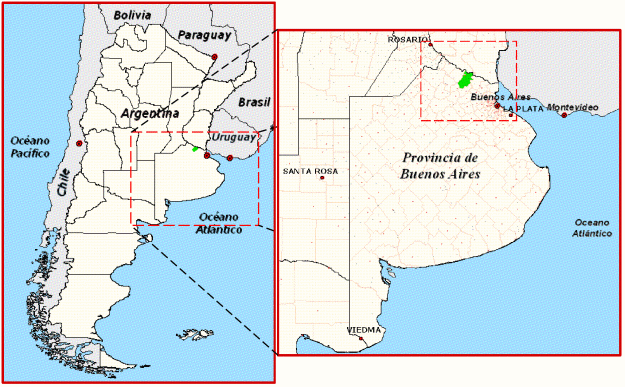
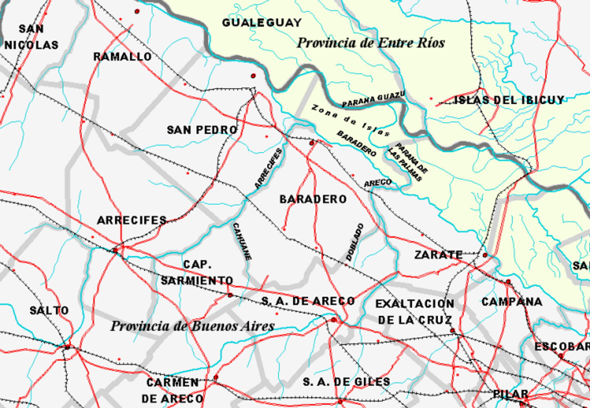

Desarrollo
==========

Para el desarrollo del trabajo se han tomado como referencia las siguientes fases metodológicas:

* `Caracterización <#caracterización>`_: en esta fase se caracteriza la situación y el contexto geográfico, se realiza una revisión histórica, un análisis socio-económico, y se detalla el estado actual de la división y el uso del suelo.
* `Diagnóstico <#diagnóstico>`_: comprende un análisis de los datos e información obtenidos en la fase anterior, tendiente a comprender los procesos de desarrollo y transformación, y las interrelaciones que actúan en el territorio de la ciudad y su entorno, y las fuerzas que operan los mismos.
* `Propuesta de solución <#propuesta-de-solución>`_: aborda el problema de elaboración de la "Ordenanza de Usos y División del suelo".
* `Anexos <#anexos>`_: incluye información detallada del marco cartográfico utilizado y los prácticos *"Territorio y Ambiente"* y *"Zonificación tipo para una manzana urbana"*.

Caracterización
---------------

Información general
^^^^^^^^^^^^^^^^^^^

La Ciudad de Baradero es la cabecera del Partido que lleva el mismo nombre y que se encuentra ubicado al noreste de la Provincia de Buenos Aires. Además es el centro económico y demográfico del mismo (ilustraciones `1 <#baradero-ubic>`_ y `2 <#baradero-limit>`_).

Según la Constitución de la Provincia de Buenos Aires, la administración de los intereses y servicios locales en cada uno de los partidos que forman la provincia, están a cargo de una municipalidad.

A continuación se muestra una síntesis de las características del Partido de Baradero:

* Superficie:	1533 km²
* Perímetro: 220 km
* Extensión:
    * 59º 46' - 59º 10' Oeste
    * 34º 10' - 33º 39' Sur
* Población del partido: 29.562 habitantes
* Distribución demográfica:
    * Población rural: 2.859 hab.
    * Población urbana:	26.703 hab.
        * Baradero: 24.901 hab.
        * Villas Alsina: 1.184 hab.
        * Portela: 449 hab.
        * Santa Coloma: 169 hab.

.. _baradero-ubic:

   Ilustración 1: ubicación a nivel nacional y provincial.

.. _baradero-limit:

   Ilustración 2: límites y entorno del Partido de Baradero.

Límites
"""""""

Los límites del Partido de Baradero son (ilustración `2 <#baradero-limit>`_):

* Al **Oeste** con el Partido de San Pedro, río Arrecifes mediante, y con el Partido de Capitán Sarmiento, en parte con el arroyo Cahuané mediante.
* Al **Sur** con el Partido de San Antonio de Areco, en parte con el arroyo Doblado mediante.
* Al **Este** con el Partido de Zárate, en parte con el río Areco mediante, y en parte con el río Paraná de las Palmas.
* Al **Norte** limita con los departamentos Gualeguay e Islas del Ibicuy, pertenecientes a la Provincia de Entre Ríos, río Paraná Guazú mediante.

Características geográficas
"""""""""""""""""""""""""""

El Partido de Baradero se encuentra dentro de la región ecológica denominada pampa húmeda, subregión pampa ondulada, llamada así debido a las ondulaciones que presenta. Estas ondulaciones se formaron debido a movimientos ascendentes y descendentes que se produjeron hace miles de años y que dieron origen a las barrancas en esta zona. Todos los partidos de la zona que están en contacto con el Paraná terminan en barranca. La de Baradero se llama barranca muerta, porque esta separada del río por un bajo o faja ribereña. Sobre este fajo ribereño corre el río Baradero, brazo del Paraná, y entre este río y el Paraná, se se encuentra la Isla de las Lechiguanas. Una parte de esta isla pertenece al Partido de Baradero. La Ciudad de Baradero se encuentra sobre la margen sur del río Baradero.

..
  ### Origen de la población
  #### Pueblos originarios
  #### Conquista y colonización
  #### Fundación de Baradero
  ### Creación del Partido de Baradero
  ### Área urbana
  ### Creación de la estación de Ferrocarril
  
  ## Actualidad de Baradero
  ### Situación Demográfica
  ### Situación económica
  ### Infraestructura urbana
  ### División del suelo
  ### Marco legal vigente

Diagnóstico
-----------

Propuesta de solución
---------------------

Anexos
------

`Anterior capítulo <objetivbos.md>`_ - `Top <#desarrollo>`_
